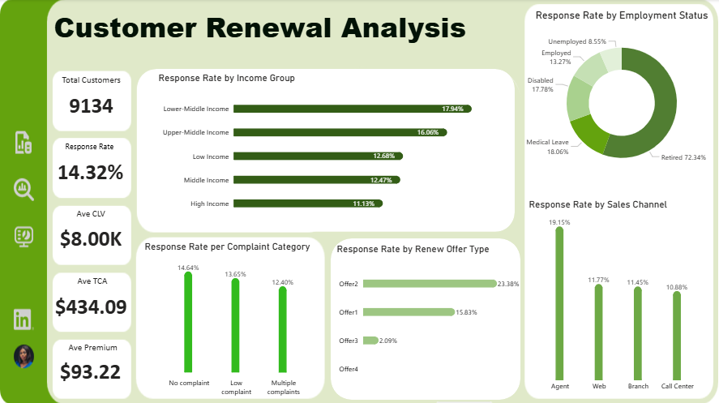
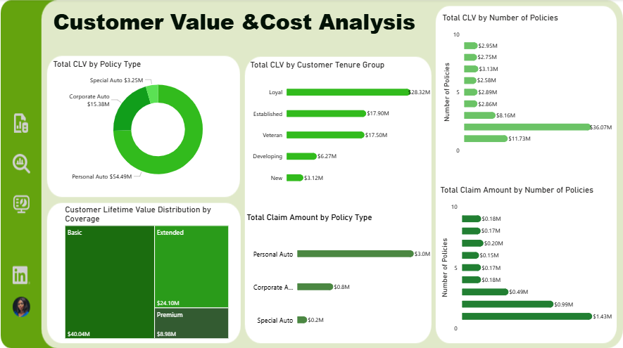

# Customer Renewal and Value Analysis

### Project overview
This project aims to understand the factors that influence customer renewal response and identify which customer segments and policy types generate the most value and cost. The overall goal is to uncover insights that can help improve customer retention and revenue growth.

### Business Questions
The key business questions this project answers include:
* What factors influence customer policy renewal response?
* Which customer segments are the most valuable to the business?
* Which policy types generate the highest revenue and claim cost?
* How do customer characteristics (income, employment status, tenure, and number of policies) affect value and response?
* Which sales channels and renewal offers drive the highest customer response?

### Dataset Overview
Data source: 
The data was provided by my mentor, Edem Faith, as part of the She Code Africa mentorship program.

Scope: 
The primary dataset used for this analysis is the "Marketing Campaign.csv" file, containing the customer demographics, policy, and business performance data. It has 9,134 rows and 27 column, including the 3 new calculated columns.

### Tool
Power Bi - used for data cleaning, analysis, and Visualisation.

### Methodology
* Data cleaning and preparation 
* Created calculated columns (Tenure group, Income group)
* Built DAX measures (Response Rate, CLV metrics)
* Performed exploratory analysis
* Built dashboards for customer response and value analysis

### Dashboard preview

### Key Insights

Customer Renewal Insights:
1. Retired customers recorded the highest renewal response (~72.34%), about 5.45× higher than employed customers, showing a strong conversion advantage.
2. Offer 2 had the highest renewal response (~23.4%), while Offer 4 received no positive responses, suggesting a potential issue with that offer.
3. The Agent channel recorded the highest renewal response (~19.2%), higher than other sales channels, suggesting human-driven interactions may influence conversions.
4. Customers in the lower-middle income segment ($19,999–$39,999) showed slightly higher renewal response (~17.9%), showing that higher income does not always mean higher renewal likelihood.

Customer Value Insights:
5. Personal Auto policy generated the highest total customer lifetime value ($54.5M). However, Special Auto customers have the highest average CLV ($8,594), meaning they are individually more valuable.
6. Customers in the Loyal tenure group (36–72 months) generated the highest revenue (~$28.3M), significantly higher than newer customers.
7. Personal Auto policies also incur higher claim costs but still generate the highest overall value, suggesting strong profitability.

### Recommendations
1. Target retired customers strategically: Develop specialized campaigns, tailored messaging, and policy bundles for retired customers, since this segment shows significantly higher renewal response.
2. Replicate the structure of Offer 2: Analyze what makes Offer 2 effective and apply similar improvements when redesigning Offer 4.
3. Strengthen the Agent sales channel: Invest in technology-driven tools and structured incentives to support agents while improving performance across other channels.
4. Retain high-performing customer segments: Focus on retaining customers in the lower-middle income segment and the Loyal tenure group, as they contribute strongly to response and revenue.
5. Grow high-value policy segments: Continue optimizing Personal Auto policies for retention while developing strategies to attract more customers to Special Auto policies.

### Conclusion
Focusing on high-response segments, improving weak offers, strengthening effective channels, and optimizing profitable policies can improve retention and revenue growth.

